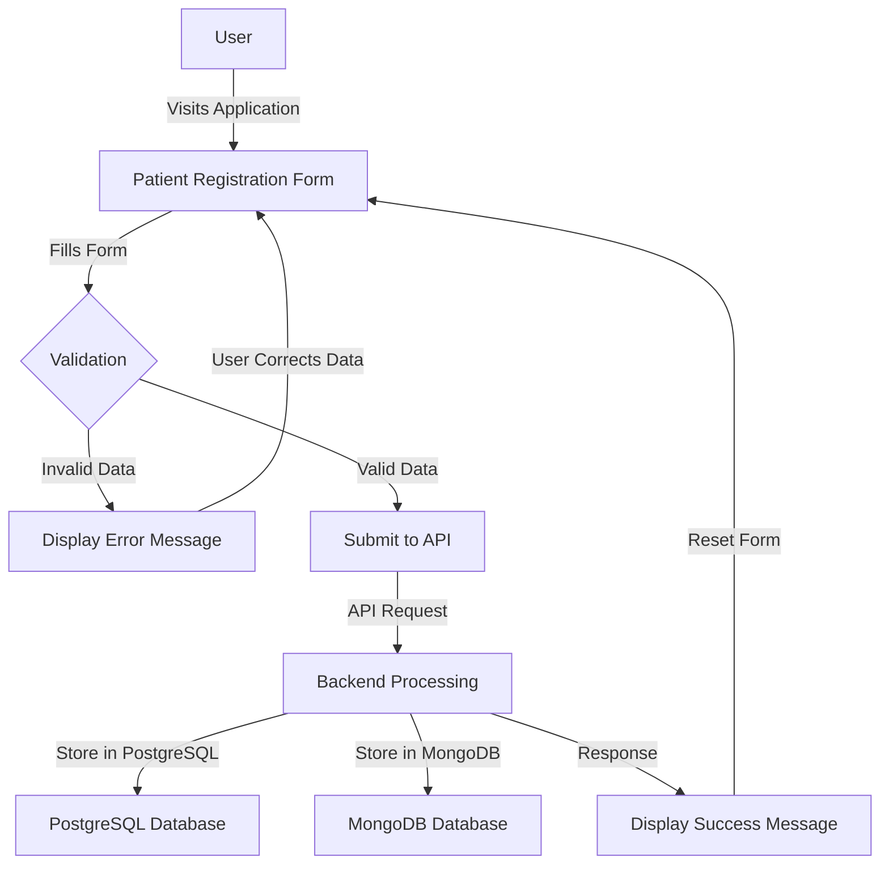
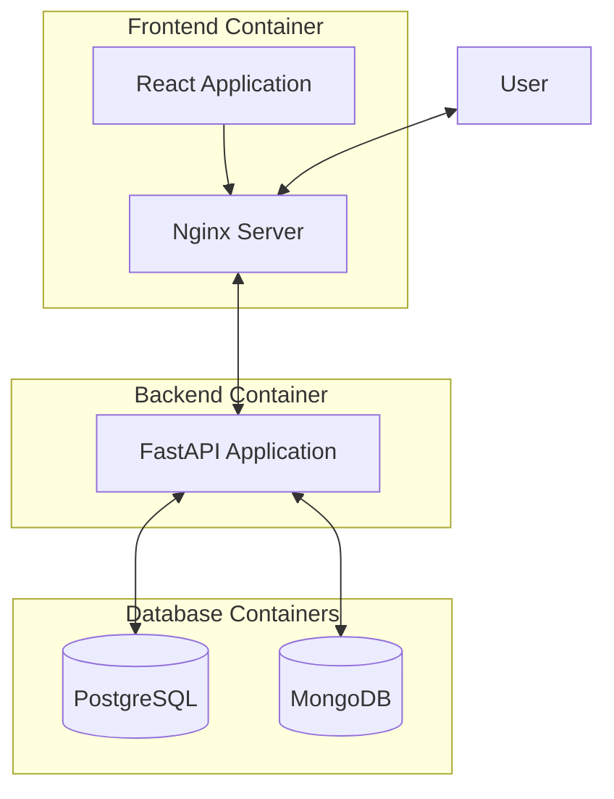

# Patient Registration Application

A full-stack application for patient registration with React.js frontend and FastAPI backend, using PostgreSQL and MongoDB for data storage.

## Features

- Patient registration form with name, age, gender, and contact information
- Data storage in both PostgreSQL and MongoDB
- Confirmation message after successful registration
- Dockerized application for easy deployment
- Unit tests for both frontend and backend

## User Flow



### Detailed Flow

1. **User Access**
   - User navigates to the application URL
   - The application loads the patient registration form

2. **Form Interaction**
   - User enters patient information (name, age, gender, contact)
   - Client-side validation occurs as the user types
   - Form highlights required fields and validates input formats

3. **Form Submission**
   - User submits the completed form
   - Frontend validates all required fields are filled correctly
   - If validation fails, error messages are displayed
   - If validation passes, data is sent to the backend API

4. **Backend Processing**
   - API receives the patient data
   - Server-side validation is performed
   - Data is stored in PostgreSQL (primary database)
   - A copy of the data with additional metadata is stored in MongoDB
   - Success response is sent back to the frontend

5. **Completion**
   - Frontend displays a success message
   - Form is reset for the next entry
   - User can submit another patient or navigate away

## System Architecture



## Tech Stack

### Frontend
- React.js
- TailwindCSS
- Axios for API requests
- React-Toastify for notifications
- Jest and React Testing Library for unit tests

### Backend
- FastAPI
- SQLAlchemy for PostgreSQL ORM
- PyMongo for MongoDB integration
- Pydantic for data validation
- Pytest for unit tests

### Database
- PostgreSQL for relational data storage
- MongoDB for document-based storage

### DevOps
- Docker and Docker Compose for containerization
- AWS for hosting (deployment instructions below)

## Project Structure

```
patient-registration-app/
├── frontend/                # React.js frontend
│   ├── public/              # Static files
│   ├── src/                 # Source code
│   │   ├── components/      # React components
│   │   ├── services/        # API services
│   │   └── tests/           # Unit tests
│   ├── .env                 # Default environment variables
│   ├── .env.development     # Development environment variables
│   ├── .env.production      # Production environment variables
│   ├── .env.example         # Example environment variables
│   ├── Dockerfile           # Frontend Docker configuration
│   └── package.json         # NPM dependencies
├── backend/                 # FastAPI backend
│   ├── app/                 # Application code
│   │   ├── database/        # Database connections
│   │   ├── models/          # Data models
│   │   ├── routes/          # API routes
│   │   └── tests/           # Unit tests
│   ├── .env                 # Default environment variables
│   ├── .env.development     # Development environment variables
│   ├── .env.production      # Production environment variables
│   ├── .env.example         # Example environment variables
│   ├── Dockerfile           # Backend Docker configuration
│   └── requirements.txt     # Python dependencies
├── docker/                  # Docker configuration files
├── docker-compose.yml       # Docker Compose configuration
└── README.md                # Project documentation
```

## Getting Started

### Prerequisites

- Docker and Docker Compose
- Git

### Running the Application

1. Clone the repository:
   ```bash
   git clone <repository-url>
   cd patient-registration-app
   ```

2. Start the application using Docker Compose:
   ```bash
   docker-compose up -d
   ```

3. Access the application:
   - Frontend: http://localhost:3000
   - Backend API: http://localhost:8000
   - API Documentation: http://localhost:8000/docs

### Running Tests

#### Backend Tests

```bash
# Inside the backend container
docker exec -it patient-registration-app_backend_1 pytest
```

#### Frontend Tests

```bash
# Inside the frontend container
docker exec -it patient-registration-app_frontend_1 npm test
```

## Development

### Environment Variables

The application uses environment variables for configuration. Example environment files are provided for both frontend and backend.

#### Backend Environment Variables

- `POSTGRES_URL`: PostgreSQL connection string
- `MONGO_URL`: MongoDB connection string
- `MONGO_DB_NAME`: MongoDB database name
- `HOST`: API host address
- `PORT`: API port number

#### Frontend Environment Variables

- `REACT_APP_API_URL`: Backend API URL
- `REACT_APP_ENV`: Current environment (development/production)

To set up your environment:

1. Copy the example environment files:
   ```bash
   # For backend
   cp backend/.env.example backend/.env

   # For frontend
   cp frontend/.env.example frontend/.env
   ```

2. Modify the variables as needed for your environment.

### Backend Development

1. Install Python dependencies:
   ```bash
   cd backend
   pip install -r requirements.txt
   ```

2. Run the FastAPI server:
   ```bash
   uvicorn main:app --reload
   ```

### Frontend Development

1. Install NPM dependencies:
   ```bash
   cd frontend
   npm install
   ```

2. Run the React development server:
   ```bash
   npm start
   ```

## Deployment to AWS

### Prerequisites

- AWS CLI configured with appropriate credentials
- ECR repositories created for frontend and backend images

### Deployment Steps

1. Build and tag Docker images:
   ```bash
   docker-compose build
   ```

2. Push images to ECR:
   ```bash
   # Login to ECR
   aws ecr get-login-password --region <region> | docker login --username AWS --password-stdin <aws-account-id>.dkr.ecr.<region>.amazonaws.com

   # Tag and push frontend image
   docker tag patient-registration-app_frontend:latest <aws-account-id>.dkr.ecr.<region>.amazonaws.com/patient-registration-frontend:latest
   docker push <aws-account-id>.dkr.ecr.<region>.amazonaws.com/patient-registration-frontend:latest

   # Tag and push backend image
   docker tag patient-registration-app_backend:latest <aws-account-id>.dkr.ecr.<region>.amazonaws.com/patient-registration-backend:latest
   docker push <aws-account-id>.dkr.ecr.<region>.amazonaws.com/patient-registration-backend:latest
   ```

3. Deploy using AWS ECS or Kubernetes:
   - Create task definitions for each service
   - Configure appropriate environment variables
   - Set up load balancers and security groups
   - Configure database connections

## License

This project is licensed under the MIT License - see the LICENSE file for details.
